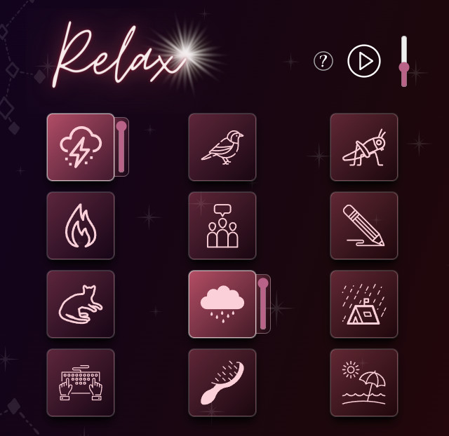

# AmbienZZZzz

> AmbienZZZzz is an easy to use ambient sound mixer. No matter if you want to focus on your work
> or fall asleep. It is proven that certain sounds help you gain focus by raising the
> hearing threshold when constantly playing.



## Tech Used

This project uses [SvelteKit](https://kit.svelte.dev/) as a base framework as a provides a comfortable environment and ridiculously easy deployment options. On top of this it integrates [WindiCSS](https://windicss.org/) - an alternative to Tailwind with a few more features - which provides all of the CSS utilities needed to style the project.

Other than that, this project is pure TypeScript and HTML5.

Tools used during creation include Audacity, Inkscape, Canva and GIMP.

## Developing

To run this app locally or to play with the code yourself, simply clone the repository and do:

```bash
npm install
npm run dev
```

You can then see the site running at http://localhost:3000/.

## Deploying the site

SvelteKit and Netlify make this process ridiculously easy. Simply committing changes to this repository make them live on the site. You can setup your own copy by forking this repository and linking it to Netlify in the same way.

## Content Attribution

This app uses sounds licensed under the Creative Commons:

* <a href="https://freesound.org/people/Sandermotions/sounds/278865/">Thunderstorm 3</a> by **Sandermotions** (licensed as <a href="https://creativecommons.org/publicdomain/zero/1.0/">CC0 1.0 Universal</a>).</li>
* <a href="https://freesound.org/people/1ratatosk1/sounds/392181/">fugler natt vaar</a> by **1ratatosk1** (licensed as <a href="https://creativecommons.org/publicdomain/zero/1.0/">CC0 1.0 Universal</a>).</li>
* <a href="https://freesound.org/people/le_abbaye_Noirlac/sounds/129339/">Cricket 4</a> by **le_abbaye_Noirlac** (licensed as <a href="https://creativecommons.org/licenses/by/3.0/">CC BY 3.0</a>).</li>
* <a href="https://freesound.org/people/petruchio_ru/sounds/256464/">Fire in the fireplace</a> by **petruchio_ru** (licensed as <a href="https://creativecommons.org/publicdomain/zero/1.0/">CC0 1.0 Universal</a>).</li>
* <a href="https://freesound.org/people/FreeToUseSounds/sounds/394331/">HOW A FRENCH CITY SOUNDS V2</a> by **FreeToUseSounds** (licensed as <a href="https://creativecommons.org/licenses/by/3.0/">CC BY 3.0</a>).</li>
* <a href="https://freesound.org/people/hannagreen/sounds/332082/">BleistiftPapier2</a> by **hannagreen** (licensed as <a href="https://creativecommons.org/licenses/by/3.0/">CC BY 3.0</a>).</li>
* <a href="https://freesound.org/people/tosha73/sounds/512223/">Cat is purring</a> by **tosha73** (licensed as <a href="https://creativecommons.org/publicdomain/zero/1.0/">CC0 1.0 Universal</a>).</li>
* <a href="https://freesound.org/people/Baconation/sounds/592482/">Medium Light Rain</a> by **Baconation** (licensed as <a href="https://creativecommons.org/publicdomain/zero/1.0/">CC0 1.0 Universal</a>).</li>
* <a href="https://freesound.org/people/Kingcornz/sounds/342434/">Soft Rain on a Tent &amp; Bird Ambiance</a> by **Kingcornz** (licensed as <a href="https://creativecommons.org/licenses/by/3.0/">CC BY 3.0</a>).</li>
* <a href="https://freesound.org/people/GeorgeHopkins/sounds/537244/">Mechanical Keyboard Typing</a> by **GeorgeHopkins** (licensed as <a href="https://creativecommons.org/licenses/by/3.0/">CC BY 3.0</a>).</li>
* <a href="https://freesound.org/people/shelbyshark/sounds/475701/">HairBrushing</a> by **shelbyshark** (licensed as <a href="https://creativecommons.org/publicdomain/zero/1.0/">CC0 1.0 Universal</a>).</li>
* <a href="https://freesound.org/people/Eelke/sounds/462591/">Beachbreak cobblestones</a> by **Eelke** (licensed as <a href="https://creativecommons.org/licenses/by/3.0/">CC BY 3.0</a>).</li>

All files have their audio levels adjusted and were remixed to work as a loop. Some files have
little parts cut out that would have destroyed the immersion of being an ongoing ambient track
(e.g. coughing, yelling, phone handling).
